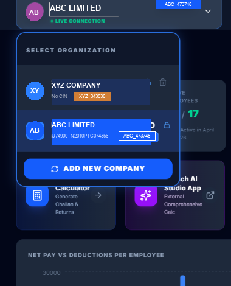
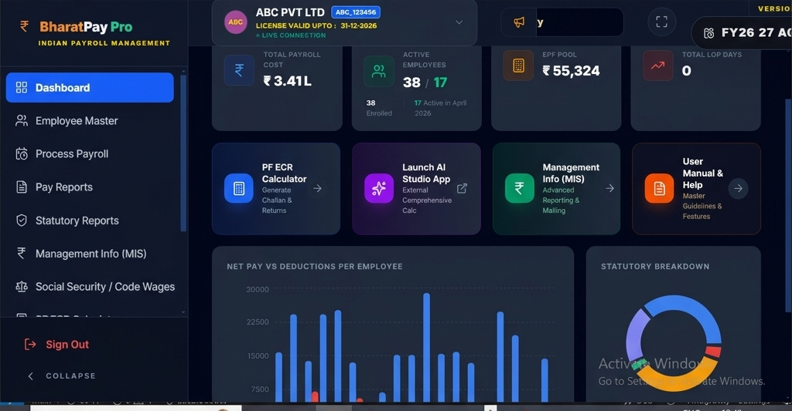

# BharatPay Pro - Comprehensive User Manual
*Version 06.01.09*

Welcome to **BharatPay Pro**, a premium Payroll Management System designed for precision, security, and ease of use. This manual will guide you through every aspect of the software, including the advanced **Multi-Company Architecture** introduced in the V06 series.

---

## 1. Getting Started

### 1.1 First-Time Installation
When you launch BharatPay Pro for the first time, the system will initialize your environment.
1.  **Data Folder Selection**: Upon the very first launch, the application will prompt you to select a master directory to store your database and generated reports. We highly recommend creating a dedicated folder (e.g., `D:\BharatPayData` or `Documents\Payroll`) on a secure, regularly backed-up drive rather than keeping it on the Desktop.
2.  **Grant Permissions**: If Windows Firewall or Anti-Virus prompts you, click "Allow" to ensure the local database and update services can run.
3.  **Registration**: New users must click **"Register Now"**. 
    *   **Verify Identity**: Provide valid credentials for OTP verification.
    *   **Set Password**: Create a strong **Administrator Password**. (This password is tied to your hardware; do not lose it!)

### 1.2 Hardware Binding & Security
BharatPay Pro uses **Hardware-Locked Identity**. Your license and data are securely tied to your specific machine.
*   **Daily Sync**: The system requires an internet connection **daily** to verify license status.
*   **Identity Restoration**: If you move to a new machine, use the **Restoration Portal** with your registered Email/Mobile.

---

## 2. Multi-Organization Management

BharatPay Pro V06 supports managing multiple establishments or companies within a single installation. Each company operates in its own **Data Silo**, ensuring total isolation of payroll, employees, and settings.

### 2.1 The Organization Gate
When you log into an installation with multiple companies, the **Organization Selector** will appear:
*   **Select Unit**: Choose the establishment you wish to work on for the current session.
*   **Single-Company Mode**: If you have only one establishment registered, the system will **Auto-Load** your dashboard directly, bypassing the selector for a faster workflow.

### 2.2 Adding a New Establishment
To manage an additional company:
1.  Go to the **Organization Gate** (via Logout or Switcher).
2.  Click **"Add New Unit"**.
3.  Complete the registration for the new establishment. It will be assigned a unique **Company ID** (e.g., CHEN01_102).

### 2.3 The Company Switcher
While working in the Dashboard, you can quickly jump between organizations:
*   Use the **Company Selector** in the header or sidebar.
*   Note: For data integrity, switching is restricted while you have an active payroll process or report open. Return to the Dashboard to switch units.

*Figure: Live Switcher Portal featuring mock isolated organizations (e.g., ABC LIMITED and XYZ COMPANY)*

---

## 3. Statutory Compliance & Settings Portal

BharatPay Pro V06 consolidates all administrative setups under the **Settings Portal**. Configuring these options accurately is critical, as they form the operational foundation for all wage calculations, security boundaries, and licensing rules.

### 3.1 The Four Essential Configuration Tabs

#### 1. Company Profile (Establishment Master Identity)
The first step in setting up a company silo is populating the core business credentials:
*   **Operational Fields**: Enter exact registered Name, Corporate Address, PAN, GST, EPF Registration Number, and ESIC Code.
*   **Formatting Compliance**: The system converts the Company Name to ALL CAPITAL LETTERS automatically to ensure compliance with banking and statutory portal formats.
*   **Downstream Impact**: These credentials are dynamically injected into bank-upload statements, monthly EPF ECR headers, ESI portal returns, and are printed at the header of all payslips and Dynamic Pay Sheets.

#### 2. Statutory Configuration (The Payroll Calculation Engine)
This tab acts as the primary calculation controller for the entire system, defining statutory ceilings, tax slabs, and optional policy modules.

> [!IMPORTANT]
> **Critical Payroll Impact:** Statutory configuration defines the mathematical rules of the salary calculator. Any error here immediately impacts net pay calculations and compliance audits:
> *   **EPF Calculations**: Select between **"Wages Ceiling Limit"** (capping contributions strictly at the statutory INR 15,000 ceiling, where employee/employer contributions are capped at INR 1,800) or **"Actual Wages"** (calculating full contributions on the actual Basic salary). Choosing the wrong option changes your company's contribution liabilities.
> *   **ESI Coverage Slabs**: Configures the statutory contribution ceiling (current limit of Gross Salary <= INR 21,000, calculating Employer 3.25% and Employee 0.75% shares). Employees crossing this gross ceiling are automatically flagged as exempt.
> *   **Professional Tax (PT) & LWF Slab Rules**: Configures PT deduction intervals (monthly, half-yearly) and coordinates the dynamic, state-specific PT slabs and LWF cycles based on local labor laws.
> *   **Policy Modules (Enable/Disable)**: Administrators can dynamically enable or disable Overtime (OT), Retroactive Salary Arrears, and Bonus calculation modules to customize their dashboard.

#### 3. License Management (Entitlements & Hardware Lock)
Displays active product keys, registration details, allowed company silos, and license expiration periods.

> [!NOTE]
> **The Crucial Need for Cloud Synchronization:**
> *   **Anti-Piracy & Key Validation**: The software utilizes a hardware-locked licensing engine. Cloud synchronization validates hardware bindings and refreshes digital signature tokens to prevent illegal copying.
> *   **72-Hour Offline Lockout Policy**: To prevent security token bypasses, the system allows up to 2 days of offline operations. On the **3rd consecutive day (72 hours)**, cloud sync is mandatory to refresh security tokens; otherwise, access is temporarily locked.
> *   **Updates & Slabs Alignments**: Syncing with the cloud keeps your tax slabs, EPF/ESI ceilings, and Minimum Wage regulations fully updated according to current government gazettes.

#### 4. User Management (Security Access Controls & Granular Roles)
Protects sensitive wage data and administrative settings from unauthorized changes:
*   **Granular User Roles**: Assign specific access rights to different team members:
    *   **Administrator / Developer**: Full root access to all data silos, database configurations, employee purges, settings modifications, and license syncs.
    *   **Operator / Manager**: Permitted to update employee details, stage monthly attendance, log advances, and compile salaries. Blocked from factory resets or bulk personnel exports.
    *   **Auditor / Viewer**: Read-only access to Pay Sheets, Leave Ledgers, and Statutory Registers. Blocked from modifying any database record.
*   **Hardware Credential Locking (High-Level Security)**: Credentials are bound strictly to the machine's local database. Sensitive actions (like ex-employee deletion, legacy database migration, settings modification, or factory data resets) are protected by **forced Administrator Password Authentication** and safety modals, ensuring complete data security.

### 3.2 Default Wage Basis (Code Wages Compliance)
By default, the statutory engine utilizes the new **Code Wages** guidelines as the basis for all social security deductions. The system monitors the **Clause 88 Threshold**, automatically checking if exclusions (allowances) exceed 50% of the employee's total gross remuneration. If exclusions exceed 50%, the excess is dynamically clawed back into the contribution wage basis in real time, shielding the company from compliance audit penalties.

---

## 4. Setting Up Your Company

After selecting your Data Folder and successfully logging in, your very first task is to configure your **Company Profile** and **Statutory Rules**. **Note: Core features like "Employee Master" and "Process PayRoll" will remain securely locked and inactive until these mandatory settings are saved.**

1.  **Company Profile**: Navigate to Settings and fill in your establishment details. Fields marked with a red asterisk (`*`) are strictly mandatory.
2.  **Statutory Configuration**: Click on the Statutory Rules tab. The system provides intelligent default values for EPF limits, ESI cutoffs, and tax slabs based on standard compliances. **Please scan through these defaults carefully.** You can modify or override these defaults to match the specific operational needs of your establishment. Ensure you click **Save** to apply the configuration. Once saved, your core modules will unlock.

### 4.1 Policy Modules: Overtime & Arrear Salary

Under the Statutory Configuration tab, you can activate advanced payroll components:

*   **Overtime (OT) Module**: 
    *   *Activation*: Toggle "Enable Overtime Calculation" to ON.
    *   *Importance*: Activating this is crucial if your establishment pays extra for extended shifts. Once enabled, the system unlocks dedicated Overtime input columns during the Pay Process.
    *   *Usage*: Before compiling salaries, you must input the respective OT hours for employees. The engine will then dynamically calculate OT earnings based on the employee's basic wage rate and instantly reflect it in their final Dynamic Pay Sheet.
*   **Arrear Salary Module**:
    *   *Activation*: Toggle "Enable Arrear Salary" to ON.
    *   *Importance*: Used for retroactive pay adjustments or delayed compensations.
    *   *Usage*: Once activated, an 'Arrears' column becomes available in the Payroll processor. You can manually input arrear amounts for specific employees, which will be seamlessly added to their gross earnings for that specific month without disrupting standard wage structures.

---

## 5. Employee Management

Navigate to the **Employees** section to manage your workforce.
*   **Bulk Import**: Use the "Import Excel" feature to migrate large datasets quickly.
*   **Data Isolation**: Employees added to one company will **never** appear in another, ensuring strict data privacy between establishments.
*   **Delete Employee**: Permitted only with active Administrator credentials. Deletion is irreversible.

### 5.1 Advanced Employee Toolbar Operations

The Personnel Master module provides a set of highly optimized, bulk-operation tools in the employee toolbar to streamline lifecycle management, data migration, and bulk adjustments:

*   **Template (Download Excel Import Template)**: Generates a clean, blank Microsoft Excel spreadsheet formatted precisely for bulk-importing new employee records. The template contains pre-defined headers mapping to essential fields (Employee ID, Name, Contact, Statutory IDs like UAN/ESI, Bank Details, and Wage Slabs).
    *   *Operation*: Click **"Template"**. The system saves the template in the establishment's configured `Reports` directory and prompts you to instantly open the destination folder.
*   **Update Template (Download Bulk Update Template)**: Exports a pre-populated Excel spreadsheet containing master details (including unique IDs, names, current active wages, and statutory registers) of all currently active employees inside the active organization silo. Administrators can modify this file directly to prepare bulk adjustments.
    *   *Operation*: Click **"Update Template"** to download. The file is saved directly inside the `Reports` directory.
*   **Import (Bulk Excel Import)**: Facilitates bulk onboardings using the blank Excel Import Template.
    *   *Operation*: Click **"Import"**, select the completed `.xlsx` template, and the system automatically parses and validates each record. After parsing, the system displays an interactive **Import Summary Modal** detailing success counts, validation failures, and offers to generate a line-by-line **Import Failure Report** (Excel/Text) listing specific validation errors (e.g. invalid date formats, missing UAN, duplicate IDs) for rapid correction.
*   **Update-Import (Bulk Excel Update Import)**: Allows administrators to perform massive, simultaneous master data adjustments (e.g. annual wage hikes, bank detail revisions, or statutory ceiling modifications) for existing employees.
    *   *Operation*: Click **"Update Import"**, select the modified Excel template generated from "Update Template". The payroll engine parses and matches the spreadsheet rows via the unique **Employee ID** key, overwriting the local database records instantly.
*   **Export (Data Export)**: Performs a secure data extraction of all active workforce records.
    *   *Operation*: Click **"Export"**. To prevent unauthorized data exfiltration, the system triggers a secure **Export Modal** requiring active **Administrator or Developer Credentials**. Once authenticated, users can selectively check or uncheck individual column attributes (e.g., Bank Account, Gross Wage, DOJ, UAN) to tailor the generated spreadsheet to their reporting needs.
*   **Rejoin (Ex-Employee Rejoining Portal)**: Provides a seamless mechanism to re-engage employees who formerly left the company (having a recorded Date of Leaving - DOL) without losing their historical payroll records or creating duplicate profiles.
    *   *Operation*: Click **"Rejoin"** to display the Ex-Employee panel list of separated staff. Search and locate the target employee, click **"Rejoin"** (which initiates the profile recovery form and clears the previous DOL), verify details under secondary Administrator authorization, enter the new **Date of Joining (DOJ)**, and save to re-activate their profile under the original Employee ID.

> [!WARNING]
> **Irreversible Employee Deletion:** Deleting an employee profile permanently purges all master record details and statutory identity parameters from the isolated silo database. To prevent accidental data loss, this function requires active **Administrator Password Authentication** and a secondary safety confirmation. Deletion will affect historical payroll references; for separated employees, it is highly recommended to record a **Date of Leaving (DOL)** instead of performing a hard purge.

---

## 6. Monthly Payroll Workflow

The "Pay Process" module follows a logical, step-by-step workflow:
1.  **Attendance**: Enter "Present Days" for the month. LOP is calculated automatically.
2.  **Leave Management**: Record leaves availed with real-time balance validation.
3.  **Advance & Fines**: Manage employee loans with automated EMI recovery.
4.  **Arrear Salary**: Compute retroactive increments with flat percentage or ad-hoc amounts.
5.  **Processing**: Click **"Calculate Salaries"**. The engine handles PF, ESI, PT, and IT (TDS) logic instantly.
6.  **Safety Backup**: Before every major update or finalization, the system creates a **Safety Snapshot** of your database and configuration in the `Data backup` folder.

### 6.1 Four-Phase Monthly Payroll Lifecycle

Below is the detailed functional breakdown of each payroll processing phase:

#### 1. Attendance Management
This phase establishes the primary work parameters (Present Days and Loss of Pay - LOP) for the active payroll month.
*   **Save Attendance**: Commits manually adjusted attendance details (Present, LOP, and Paid Leave days) for individual employees directly to the active month's staging database.
*   **Download Template**: Generates and downloads a custom Microsoft Excel attendance sheet pre-populated with all active employee IDs and names registered for the selected payroll month.
*   **Import Data**: Parses and bulk-imports attendance from the completed Excel sheet, automatically matching records by Employee ID, validating days against the active month's calendar, and computing LOP staging records instantly.

#### 2. Advance & Loan Ledgers
This phase manages employee loans, principal advances, and interest-free payroll deductions.
*   **Save Ledger**: Registers a new principal advance or interest-free loan for an employee, specifying the outstanding loan balance and the standard monthly EMI recovery amount.
*   **Clear Data**: Safely erases or resets all temporary, uncalculated advance adjustments staging in the current month's buffer to prevent staging data corruption.
*   **Template**: Downloads a standard bulk-entry Excel spreadsheet configured specifically to log loan distributions and principal advances offline.
*   **Import Data**: Bulk-loads advances and active loan registers from the completed Excel template directly into the isolated silo database.

#### 3. Tax & Fines (Deductions)
This phase stage commits ad-hoc statutory adjustments, TDS, and disciplinary deductions.
*   **Save Records**: Records manually entered ad-hoc taxes, income tax adjustments, TDS allocations, or specific disciplinary fines into the current month's payroll staging log.
*   **Download Template**: Downloads a pre-formatted Excel template containing active employee IDs to facilitate offline entry of ad-hoc deductions and fines.
*   **Import Data**: Parses and bulk-updates monthly ad-hoc taxes and disciplinary fines from the spreadsheet, automatically matching Employee IDs and applying real-time deduction safety ceiling validations.

#### 4. Run Payroll & Finalization
This phase triggers the core calculation engine to compute wages and generate audit sheets.
*   **Calculate / Recalculate**: Triggers the multi-thread payroll engine. It computes gross wages, deducts attendance LOP, recovers EMIs from outstanding advance balances, adds retroactive salary arrears, processes TDS/fines, and automatically calculates central compliance contributions (EPF, ESI, Professional Tax, and LWF) in milliseconds.
*   **Save Draft**: Saves the completed payroll calculations as a safe draft staging state, allowing administrators to lock and review the compiled salaries before formal month-end finalization.
*   **Static / Dynamic PaySheet**:
    *   *Static PaySheet*: Generates a standard, unchangeable payroll summary spreadsheet—ideal for fixed compliance audits and traditional bank transfer archiving.
    *   *Dynamic PaySheet*: Generates a highly customizable interactive tabular report. Administrators can filter by Site, Branch, or Division and dynamically add, remove, or re-order column fields (such as Basic, HRA, DA, PF, ESI) to produce custom-tailored reports.

---

## 7. Pay Reports
Once the payroll is processed, you can generate various reports:
*   **Pay Sheet**: Filterable by **Site, Branch, or Division**. Export as PDF or Excel.
*   **Pay Slips**: Professional slips for individual or bulk generation.
*   **Bank Statement**: Ready-to-use transfer instructions.

### 7.2 Payroll Finalize: Select Report & Configuration

Once you click "Finalize Payroll," the system enters the **Report Selector & Configuration** portal, offering an array of comprehensive statutory and audit reports. Each report can be dynamically configured and exported:

*   **1. Monthly Pay Sheet (Dynamic & Static Formats)**: Provides a highly granular wage distribution summary for auditing and historical archives.
    *   *Configuration*: Filter the sheet dynamically by **Site, Branch, or Division**. Choose between the **Static format** (fixed column structures ideal for traditional audits) or the **Dynamic format** (opens an interactive grid where you can toggle individual columns like HRA, washing allowances, statutory PF, and ESI before exporting).
    *   *Output*: Click **"Export to Excel"** or **"Export to PDF"** to save the compiled wages directly to the unit's local reports folder.
*   **2. Pay Slips (Individual & Bulk Generation)**: Generates professional-grade individual salary slips showing detailed gross earnings and deductions.
    *   *Configuration*: Generate slips for a single selected employee or choose **"Bulk Slips"** to compile pdfs for the entire workforce. You can opt to encrypt the PDFs automatically (using employees' unique password bindings like PAN/DOB).
    *   *Delivery*: Utilize the built-in **Heartbeat Mailing Service** to send secure, encrypted payslips directly to employee email addresses in a single bulk operation.
*   **3. Bank Statement (Transfer Excel/Text)**: Compiles bank-uploadable transfer templates showing Net Pay amounts.
    *   *Configuration*: Select from a list of standard bank portal layout templates (e.g. SBI, HDFC, ICICI, etc.) to match your corporate banking portal.
    *   *Output*: Generates a ready-to-upload spreadsheet containing Employee Name, Bank Account Number, IFSC Code, and Net Pay Amount, eliminating manual typing errors on bank portals.
*   **4. Leave Ledger (Accruals & Balances)**: Tracks statutory leave logs and employee leave accounts.
    *   *Configuration*: Select **"Leave Ledger"** to review a full audit history of availed leaves (EL, SL, CL), standard month-on-month accruals, LOP deductions, and carry-forward balances.
    *   *Output*: Export as a complete company-wide leave spreadsheet or print individual leave cards.
*   **5. Advance Shortfall Report (Loan Recovery Auditing)**: Monitors loan accounts, active advances, and recovery statuses.
    *   *Configuration*: Triggers a recovery audits sheet showing standard monthly loan EMIs. It specifically flags **"Advance Shortfalls"**—where an employee's net earnings were insufficient (due to excessive LOP or unpaid leaves) to recover the standard staged monthly loan EMI.
    *   *Output*: Logs the outstanding loan balance, the recovered amount, the shortfall deficit, and carries the deficit forward securely to the next month's staging buffer.
*   **6. Arrear Salary Revision Ledger**: Audits retroactive wage revisions and arrear distributions.
    *   *Configuration*: Displays retroactive increments, detailing calculations based on the custom ad-hoc revision percentages or absolute flat values. It lists the **Effective Month** from which the arrears were computed.
    *   *Output*: Outputs an audit-ready revision spreadsheet illustrating the month-on-month basic pay difference, DA difference, and statutory recalculations.

### 7.3 Advanced MIS Dashboard & Analytics

BharatPay Pro features a comprehensive, graphics-driven MIS Dashboard that converts raw payroll data into powerful business insights. This portal allows administrators to monitor payroll overheads, wage trends, and run advanced compliance audits through three key components:

*Figure: MIS Dashboard analytics highlighting variance and salary growth trends*

#### 1. Dynamic Report Builder (Ad-Hoc Custom Query Engine)
The Dynamic Report Builder gives administrators absolute control to compile custom-tailored spreadsheets, bypassing standard fixed layout reports. It is the ultimate tool for corporate audit preparation and ad-hoc analysis.

**Step-by-Step Workflow to Generate Custom Reports:**
1.  **Launch Module**: Navigate to the **MIS Dashboard** and click the **"Dynamic Report Builder"** tab.
2.  **Select Column Attributes**: You will be presented with a structured checklist containing all employee data dimensions in the database. Select the columns you need:
    *   *Personal Details*: Employee ID, Name, DOJ, DOB, PAN, Aadhar, UAN, ESI IP Number.
    *   *Wage Components*: Basic Wages, DA, HRA, Washing Allowance, Special Allowances, Gross Pay.
    *   *Deductions & Recoveries*: Provident Fund (PF), ESI, Professional Tax (PT), LWF, Monthly Loan EMI, TDS, Disciplinary Fines.
3.  **Apply Filtering Criteria**: Select specific criteria to narrow down the dataset. You can filter dynamically by **Site**, **Branch**, **Division**, or choose a specific **Payroll Month** and **Financial Year** context.
4.  **Set Sorting Priorities**: Choose your sorting column (e.g., sort alphabetically by Employee Name, or numerically by Employee ID or Net Pay).
5.  **Compile & Preview**: Click the **"Generate Report"** button. The system instantly queries the isolated sqlite silo database and renders a live, interactive preview grid on screen.
6.  **Export & Share**: Click **"Export to Excel"** to download a fully formatted, ready-to-present Microsoft Excel spreadsheet directly to your unit's configured `Reports` directory.

#### 2. Increment Analysis (Salary Growth & Overhead Auditing)
The Increment Analysis engine tracks salary adjustments, wage increases, and financial overhead trends across the company:
*   **Financial Overhead Planning**: Allows company executives to compare payroll costs month-on-month or year-on-year, projecting budget variances and visualising salary growth trends through interactive charts.
*   **Policy Verification**: Helps administrators review and audit newly applied increments to ensure they conform to internal salary bands and standard grading policies.
*   **Social Security Impact Simulation**: Evaluates if increments will push employee wages past central statutory ceilings (such as the INR 15,000 EPF ceiling or the INR 21,000 ESI ceiling), helping you estimate employer contribution shifts.

#### 3. Heartbeat Mailing Service (Secure Bulk Payslip Delivery)
The Mailing Service handles the automated distribution of secure, individual payslips to the entire workforce's registered email addresses:
*   **Bulk Automated Delivery**: Eliminates the need to print and manually distribute physical payslips. A single click initiates background email queuing, dispatching digital payslips to hundreds of employees simultaneously.
*   **Secure PDF Encryption (CONFIDENTIALITY SAFEGUARD)**: To prevent unauthorized access, every generated payslip PDF is automatically encrypted with a unique password. The password combination strictly matches employee-specific master data (typically the employee's registered PAN in uppercase followed by their Date of Birth in `DDMMYYYY` format).
*   **Heartbeat Dispatch Queue**: The process runs in the background using an asynchronous mailing worker. The UI displays a live progress bar and heartbeat logs illustrating success rates, sent counts, and failure tracking. If a failure occurs (e.g. invalid email address), the system generates a downloadable failure report for immediate administrative correction.
*   **SMTP Configuration**: Detailed step-by-step instructions on setting up your email SMTP server coordinates, port allocations, and SSL/TLS keys are available by clicking the **"Configure Mailing Credentials"** link directly inside the module settings.

## 8. Statutory Reports & Compliance Portal

BharatPay Pro features a fully integrated Statutory Compliance Engine that automates complex central and state government calculations. The portal generates error-free, portal-compliant files formatted precisely to match official upload specifications:

### 8.1 Employees' Provident Fund (EPF) Compliance
The EPF module is designed to eliminate manual data formatting and conversion tasks on the EPFO Unified Portal:
*   **Electronic Challan-cum-Return (ECR) Generation**: Automatically compiles and exports the monthly ECR file in the official text-delimited format (separated strictly by the `#~#` delimiter). The file is immediately ready for upload without needing external text translation. The system monitors statutory wage ceilings (standard ceiling of INR 15,000 or custom actual calculations) and maps active UAN registers dynamically.
*   **Arrear ECR Filings**: Facilitates retroactive wage revisions, delayed onboarding calculations, or out-of-period pay updates. It compiles separate, compliant ECR text files with distinct retroactive period attributes, detailing the exact months to which the wages apply, ensuring clean compliance under EPF Section 7Q and 14B rules.
*   **Contractor Mapping & Audit Portal**: For principal employers managing sub-contractor staff, this portal allows you to map contractors to your primary establishment. It tracks contractor-independent UAN declarations, ECR filings, and individual contributions, shielding the parent company from primary establishment liability audits.
*   **Statutory PF Forms**: Generates print-ready copies of **Form 12A** (Monthly Currency Return), **Form 3A** (Individual Ledger Card), and **Form 6A** (Annual Consolidated Statement) for your internal archives and physical labor audits.

### 8.2 Employees' State Insurance (ESI) Portal Integration
Maintains full sync with the ESIC guidelines to ensure employee medical cover calculations are audit-clean:
*   **Monthly Contribution Return (Excel Format)**: Automatically compiles monthly wage data and exports the ESI Monthly Return spreadsheet formatted exactly to match the ESIC unified portal upload schema. The system automatically computes contributions based on the active statutory ceiling (Gross Salary <= INR 21,000, calculating Employer 3.25% and Employee 0.75% shares).
*   **Statutory Form 5 (Half-Yearly Return)**: Automatically generates and compiles the Half-Yearly ESI Contribution Return (Form 5) for compliance periods (April-September and October-March), complete with automated counts and audit-ready summaries.
*   **Joiner & Leaver Declaration Lists**: Extracts separate registers for new joiners (requiring IP Number allocation) and separated employees (flagged with exit codes and ESI exit dates) to expedite monthly portal updates.

### 8.3 Taxes, Licenses & Welfare Funds
Handles localized state compliance tasks smoothly:
*   **Professional Tax (PT) Slab Management**: Features an active state-specific slab engine. Based on the employee's assigned work location/site, the system automatically applies local state slabs (e.g., Maharashtra, Karnataka, Tamil Nadu, West Bengal) and calculates monthly, half-yearly, or annual PT deductions.
*   **Labour Welfare Fund (LWF) Automation**: Automates state-specific LWF schedules, calculating Employer and Employee welfare contributions at the correct statutory rates during specified deduction cycles (e.g., June and December).
*   **Statutory Labor Registers (Ministry of Labour & Employment)**:
    *   **Form B (Wage Register)**: Generates the highly detailed, legal Wage Register under Rule 21(1) of the Minimum Wages Rules, detailing rates of wages, actual days worked, gross earnings, itemized deductions (PF, ESI, PT, Advances), and net pay amounts.
    *   **Form C (Muster Roll / Attendance Register)**: Automatically prints the statutory attendance card listing daily attendance markings, weekly holidays, overtime hours, and total present days, fully audit-compliant and ready for labor inspector reviews.

---

## 9. Code Analysis & Social Security Simulator

Prepare your organization proactively for the upcoming **Social Security Code 2020** with high-fidelity compliance simulators. The engine strictly models the **Clause 88 Threshold**—which mandates that statutory exclusions (allowances) cannot exceed 50% of the employee's total gross remuneration. If exclusions cross 50%, the excess is automatically clawed back into the statutory contribution wage basis.

The system compiles detailed impact reports for both **EPF** and **ESI** schemes, helping you evaluate financial shifts using three distinct simulation channels:

### 9.1 EPF Impact Analysis Portal
Simulates liability variations if the new Code Wage definition is applied to Employee Provident Fund contributions:
*   **Theoretical Impact Report**:
    *   *How it works*: Analyzes active contractual wage setups inside the employee master. It dynamically calculates the projected 50% exclusion ceiling for each worker to determine the new projected statutory PF salary.
    *   *Purpose*: Enables HR and Finance to project future monthly contract PF liabilities and restructure baseline pay templates prior to official code implementation.
*   **Historical Impact Report**:
    *   *How it works*: Scans and processes historical payroll runs in the silo database. It retrospectively recalculates past pay sheets as if the Social Security Code had been active in those months.
    *   *Purpose*: Delivers precise cash-flow comparison reports, illustrating historical statutory overhead variances and variance trends.
*   **Excel Data Impact Report**:
    *   *How it works*: Facilitates offline "what-if" planning. You can upload custom salary spreadsheets (bulk offline templates), which the engine parses and models to generate a detailed PF impact sheet.
    *   *Purpose*: Permits mock restructuring audits and salary grading tests in a sandbox environment before changing active live databases.

### 9.2 ESI Impact Analysis Portal
Simulates ESI medical cover contributions and statutory eligibility shifts:
*   **Theoretical Impact Report**:
    *   *How it works*: Evaluates active contractual wages to determine future ESI liabilities. Crucially, it monitors the statutory eligibility ceiling (Gross Wages <= INR 21,000) under the new Code Wage definitions.
    *   *Purpose*: Identifies employees who may cross the ESI eligibility threshold, projecting future overall corporate healthcare cost fluctuations.
*   **Historical Impact Report**:
    *   *How it works*: Re-evaluates processed payroll records from past months. It retrospectively recalculates ESI deductions and employer shares to show precise statutory variance logs.
    *   *Purpose*: Compiles actual historical expenses against simulated ESI costs, giving a granular audit breakdown of retroactive shifts.
*   **Excel Data Impact Report**:
    *   *How it works*: Processes offline salary structure spreadsheets to test proposed pay adjustments against ESI eligibility and statutory deduction rules.
    *   *Purpose*: Allows organizations to test salary grading packages offline, identifying ESI coverage impacts before employee rollout.

---

## 10. Legacy Data Migration

The Legacy Data Migration module is an advanced ETL (Extract, Transform, Load) pipeline designed strictly to bridge the architectural gap between older single-company environments and the new multi-establishment database platform.

> [!IMPORTANT]
> **Under what circumstance is it used?**
> This utility is used **only** when an organization is upgrading from a legacy major version of BharatPay Pro (specifically the **V2 series** or older, which operated in a single-company environment where all database records were globally stored under a single, non-isolated file structure).
> *Do NOT use this tool for daily backups, restoration of current V5 environments, or moving data between active V5 installations (for which you should use standard Backup and Restore tools under Section 11).*

### 10.1 Why is Legacy Migration Required?
In older legacy versions, employee profiles, statutory registers, and monthly payroll histories lacked a distinct **Establishment ID** or **Company Silo Scope**. The V5 engine runs in a fully isolated sandbox environment. The migration engine is built to safely reflow, map, and import those older structures into the new Multi-Company system without data loss or record duplication.

### 10.2 How it Works: Step-by-Step Migration Guide
1.  **Silo Provisioning**: First, launch BharatPay Pro V05 and register a brand new establishment silo to act as the destination container for the legacy data (following the steps in Section 2.1).
2.  **Access the Utility**: Log into your newly created establishment silo, navigate to **Utilities > Data Management** from the main dashboard, and select the **"Previous Version Data"** tab.
3.  **Upload Legacy Database**: Click the **"Import Legacy Database"** button and browse to locate your legacy backup file (typically named `active_db.sqlite` or an encrypted `.enc` backup file from your old installation).
4.  **Automated Structural Transformation**: Once uploaded, the migration engine runs a background processing pipeline:
    *   *Entity Mapping*: Automatically parses legacy tables and maps the global employee records to new unique, company-scoped ID schemas (preventing key conflicts).
    *   *Wage Slabs Conversion*: Transforms older wage components to conform to the new **Code Wages** and statutory definition rules.
    *   *History Recompilation*: Rebuilds past monthly payroll logs and staging databases month-by-month, carrying forward historical leave balances and advances securely.
5.  **Verify Migration Logs**: Upon completion, the system displays a migration summary log, showing total migrated employee records, historic payroll months recovered, and flags any statutory field mismatches (like missing UAN or ESI registers) for immediate correction.

> [!WARNING]
> **One-Time Operation:** Migration should only be performed once per legacy establishment. Performing a legacy import on an active, populated V5 silo will overwrite the current database and corrupt active staging records. Always perform a local secure backup before initiating any migration actions.

---

## 11. Data Management Functions

BharatPay Pro provides advanced data maintenance tools to ensure your establishment records remain healthy and secure. Each function is strictly scoped to the **active establishment** only.

### 11.1 Backup Data (LOCAL SECURE BACKUP)
Creates a high-security encrypted snapshot (`.enc`) of the active establishment's database. It is highly recommended to perform a backup before every payroll finalization.

### 11.2 Restore Data (UNIVERSAL RESTORATION)
Imports an existing backup into the current establishment silo. This will overwrite the current unit's data with the contents of the backup. Use this for data recovery or migration.

### 11.3 Previous Version Data (LEGACY MIGRATION)
Provides a seamless import path for legacy databases, restoring structured employee and historical pay records from previous V3 or V4 major versions into the new multi-unit environment.

### 11.4 Partial Payroll Reset (ONLY PAY DATA RESET)
Clears only the payroll results for the **current active month**. This allows you to start the monthly processing from scratch if errors are detected, without affecting your Employee Master or previous months' history.

### 11.5 Factory Reset (Company Scope)
Wipes **all** data associated with the current establishment (Employees, Payroll History, and Settings). This action is permanent and requires the Administrator Password. Other establishments in your installation remain unaffected.

### 11.6 Purge System Logs
Cleans the background activity logs and temporary calculation files. Regular purging helps maintain high application performance during complex payroll runs.

### 11.7 Purge Company (Permanent Silo Deletion)
Permanently deletes an entire establishment silo, erasing its sqlite database file and all physical folders from your installation. This frees up licensed company slots if an establishment is closed or created by mistake.

> [!WARNING]
> **Active Silo Protection Lock:** To prevent catastrophic data loss, the system **never** allows you to delete or purge the currently active company. If you attempt to delete the active company, a prohibited warning is shown.
> *The "Shut Company" Rule:* To purge a company, you must first switch to another active company (rendering the target company "inactive" or "shut" in your session), return to the Company Selector (Organization Gate), and then perform the delete action.

#### Step-by-Step Deletion Flow:
1.  **Open Organization Gate**: Go to the startup Company Selector portal (via startup, logging out, or clicking "Exit to Company Gate" in Settings).
2.  **Toggle Purge Mode**: Click the red **"Delete Company"** button in the Selection screen to enter Purge Mode. Inactive companies will display a red Trash/Delete icon.
3.  **Select Inactive Company**: Click the delete icon on the target "shut" company.
4.  **Verify Security Password**: The **Secure Purge Authorization** modal will appear.
5.  **Authenticate**: Enter your active **Administrator Password** and click **"Authorize Purge"**. The engine will instantly wipe all database tables, delete the local SQLite file and folder structure, and free up the licensed slot.

---

## 12. Troubleshooting & Support

### 12.1 Common Errors
*   **"Security Violation"**: Occurs if system clock is changed. Reset to "Internet Time".
*   **"License Locked"**: Ensure internet connectivity. For hardware changes, use **Identity Restoration**.

### 12.2 Contacting Support
📧 **Email**: ilcbala.Bharatpayroll@gmail.com
📞 **Support**: Refer to your License Agreement for the dedicated helpdesk number.

### 12.3 Important Troubleshooting
> [!IMPORTANT]
> **IN CASE THE APP FAILS TO LOAD OR IS CORRUPTED**, go to the main installation folder (e.g., `D:\BharatPayRoll`) and **DOUBLE CLICK THE Launch_BPP_Installer.exe** to download/install fresh and launch the app again without any errors.

---
*© 2026 BharatPay Pro. All Rights Reserved.*
